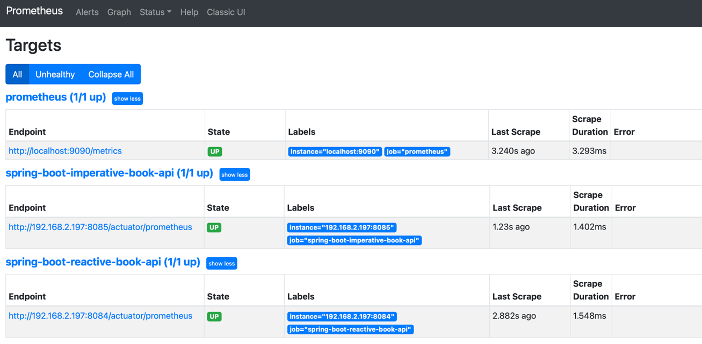

# Crossing the chasm quarkus

This project has been configured to let you generate a lightweight container running a native executable.
You can find the presentation in the following link: 

https://estefaniaexamples.github.io/crossing-the-chasm-quarkus

## Table of content

- [Installation](#installation)
    - [Java GraalVM](#java-graalvm-installation)
    - [Docker](#docker-installation)
    - [Infrastructure](#install-all-infra)
        - [Prometheus](#prometheus-installation-and-set-up)
        - [Grafana](#grafana-installation-and-set-up)
        - [PostgreSQL Database](#postgresql-database)
- [Services setup](#services-setup)
    - [SpringBoot Reactive Books API](#springboot-reactive-books-api)
    - [SpringBoot Imperative Books API](#springboot-imperative-books-api)
    - [Quarkus Reactive Books API](#quarkus-reactive-books-api)
    - [Quarkus Imperative Books API](#quarkus-imperative-books-api)
- [License](#license)
- [Links](#links)


## Installation

This project has been tested with the following versions:

- GraalVM: GraalVM Version 21.0.0.2 (Java Version 11.0.10+8-jvmci-21.0-b06)
- Maven: Apache Maven 3.8.1 
- Docker desktop: 3.3.1 (63152)

### Java GraalVM Installation
It is highly recommended to use [SDKMAN](https://sdkman.io/install) to install and manage java versions.`

Once you have Java GraalVM installed, you need to install native-image with the following command: ``` gu install native-image ```


### Docker installation
Docker should be installed and configured on your machine prior to creating the image, see [the Getting Started section of the reference guide](https://docs.spring.io/spring-native/docs/0.9.1-SNAPSHOT/reference/htmlsingle/#getting-started-buildpacks).


### Infrastructure installation

This project includes a docker compose file that will set up all the infrastructure the services need to be executed. The following command will do all the job for you: 

``` docker compose up ```  (bear in mind you have to be in the /infrastucture folder to run this command).

Anyway, if you want to do it manually you can follow the below steps for each of the components we need. 

#### Prometheus Installation and Set up

There is a file in the project infrastructure/monitoring folder called ``` prometheus.yml ``` that contains the required configuration.
You must change the update the target putting there your computer IP address. Then, you just need to run the following command

``` docker run -d -p 9090:9090 -v <PATH_TO_prometheus.yml_FILE>:/etc/prometheus/prometheus.yml prom/prometheus:v2.26.0 ``` 

to be able to have our prometheus server working. If everything goes ok, you should be able to see a screen like  this:



#### Grafana Installation and Set up
To install Grafana you need to run the following docker command: 

``` docker run -d -p 3000:3000 grafana/grafana:7.5.4 ```

Once Grafana is up and running, you have to configure the prometheus source, you can do it following this [tutorial](https://ordina-jworks.github.io/monitoring/2020/11/16/monitoring-spring-prometheus-grafana.html).
The dashboard I used to monitor our application is the JVM Micrometer dashboard with import id: 4701.


#### PostgreSQL Database
The services connect against a PostgresSQL database, so that we need to install it. To do it you just need to run this command:

``` docker run --name my-postgres -e POSTGRES_PASSWORD=book -e POSTGRES_USER=book -e POSTGRES_DB=books_database -d postgres:9.6.21-alpine -v ./db-init/setup.sh:/docker-entrypoint-initdb.d/initdb.sh ```

More information about how PostgreSQL docker image works is [here](https://hub.docker.com/_/postgres?tab=description)


## Services SetUp

This project includes a docker compose file that will start all the services for you (take into account we need the infrastructure up and running). 
In this file you should update the ip address and put your computer ip so that the service is able to find the PostgresSQL server. After that, 
the following command will do all the job for you: 

``` docker compose up ```  (bear in mind you have to be in the root path to run it).

### SpringBoot Imperative Books API

### SpringBoot Reactive Books API

To create the native image, run the following goal:
```
$ mvn clean -Pnative-image package
```

To create the docker image in order to build a container that runs the Spring Boot application in native (no JVM) mode, run the following goal:

```
$ mvn spring-boot:build-image
```

Then, you can run the app like any other container:

```
$ docker run -i --rm -p 8080:8080 project-name:latest
```


### Quarkus Imperative Books API

### Quarkus Reactive Books API

To create the linux native image, run the following goal:
```
$ ./mvnw package -Pnative -Dquarkus.native.container-build=true
```

To create the docker image in order to build a container that runs the Quarkus application in native (no JVM) mode, run the following goal:

```
$ docker build -f src/main/docker/Dockerfile.native -t quarkus/quarkus-reactive-bookAuthors-api .
```

Then, you can run the app like any other container:

```
$ docker run -i --rm -p 8080:8080 project-name:latest
```

